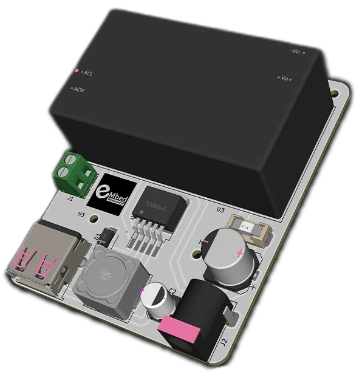
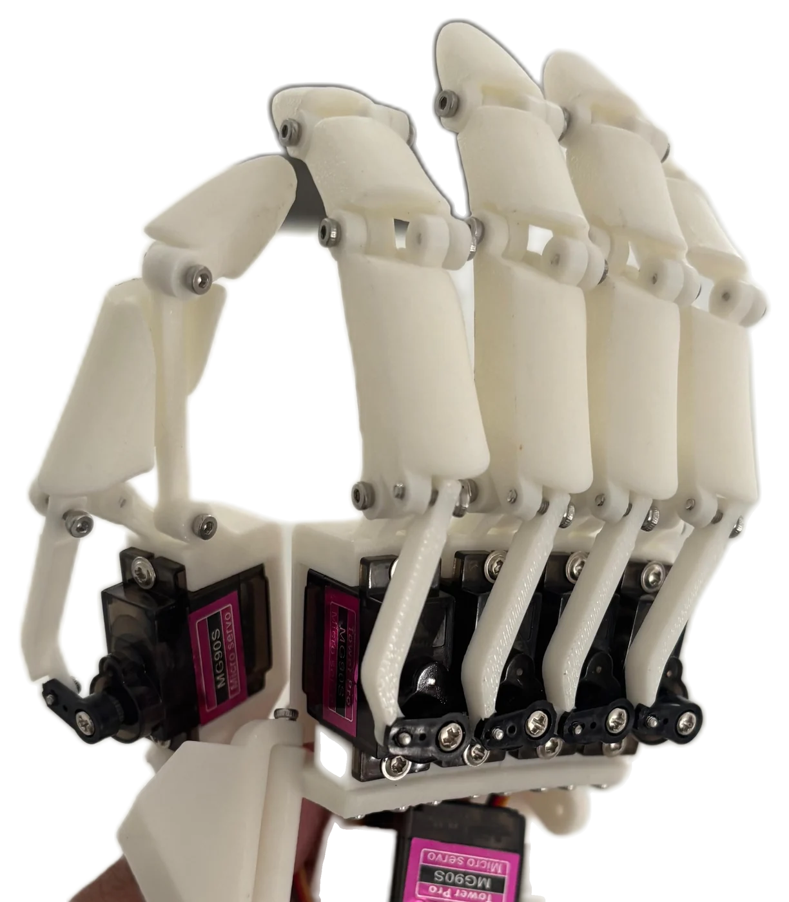
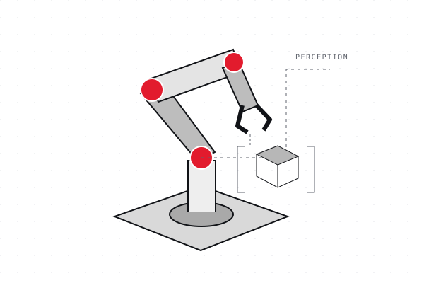
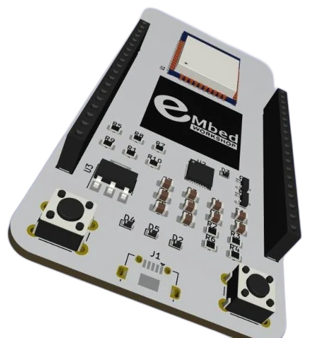
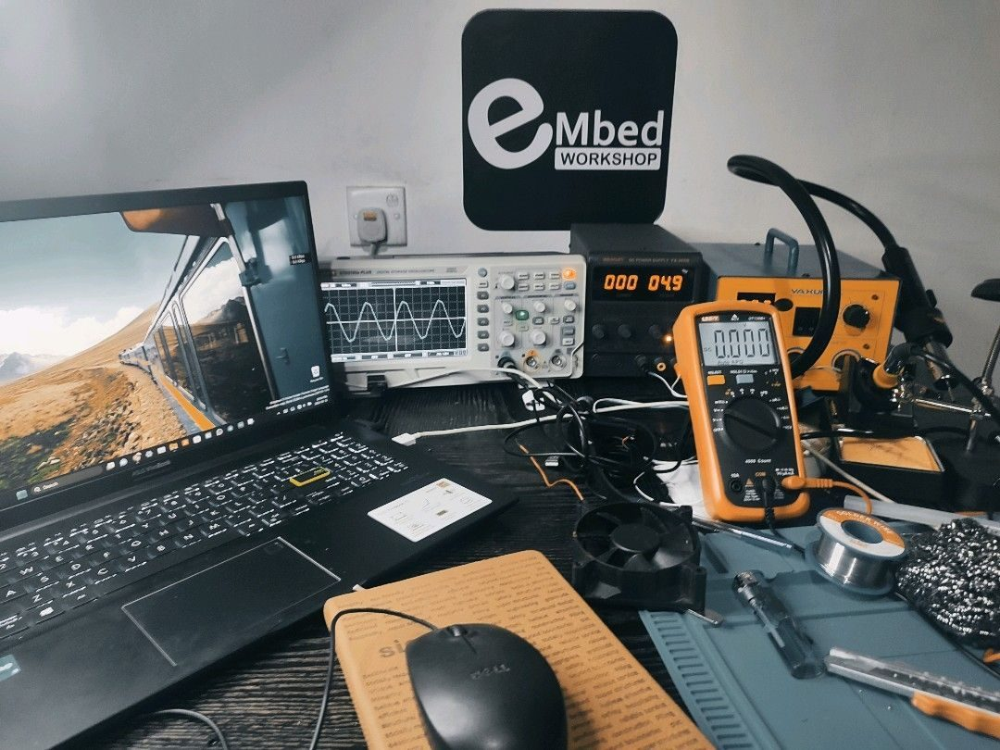

<!-- Generated by scripts/build.mjs from content/profile.json. Edit the source, then rebuild. -->
<picture>
  
  
</picture>

<a href="#a-quick-introduction">Introduction</a> · <a href="#selected-work">Selected work</a> · <a href="#open-source-project">Open source</a> · <a href="#engineering-focus">Engineering focus</a> · <a href="#lets-talk">Contact</a>

## A quick introduction

**Hi, I’m Lahiru Maduranga, an Embedded Systems Engineer from Sri Lanka.**

I’m an Embedded Systems Engineer with more than five years of hands-on experience developing firmware, integrating hardware, and building intelligent connected systems.

My work combines low-level embedded programming, sensor interfacing, communication protocols, robotics, computer vision, and edge AI. I enjoy working across the full engineering lifecycle — from understanding hardware constraints and designing system interfaces to implementing algorithms, debugging complex failures, and validating complete systems.

I focus on practical engineering, reliable implementation, and solutions that connect physical devices with intelligent software.

**[LinkedIn](https://www.linkedin.com/in/lahiru-maduranga97/) · [GitHub](https://github.com/LahiruMaduranga) · [Portfolio](https://lahirumaduranga.github.io/)**

## Find the work relevant to you

| Your interest | Start here |
| --- | --- |
| Embedded engineering roles | [Voice-controlled media](#open-source-project) |
| Robotics and automation | [Card sorting and vision-guided manipulation](#selected-work) |
| Product development or collaboration | [Connect on LinkedIn](https://www.linkedin.com/in/lahiru-maduranga97/) |

## Selected work

Project photographs and design renders are labelled individually. Confidential case studies are anonymized, described at a high level, and shown without project imagery or source-repository links.

### ALPR Unit with Gate Control

*Prototype unit: ALPR unit with gate control.*

**Computer Vision / Access Control · 2023–2024**

An automatic license plate recognition unit with a gate-control function.

Project overview

An automatic license plate recognition unit with gate control. A camera inside the standing enclosure captures approaching vehicles, and the recognition result drives the gate-control output.

[Discuss this project on LinkedIn](https://www.linkedin.com/in/lahiru-maduranga97/) · [Project page](https://lahirumaduranga.github.io/projects/alpr.html)

### Autonomous Rover & Sensor Integration

*Prototype: Autonomous rover prototype with LiDAR and stereo-camera sensing.*

**Robotics / Embedded Systems / Perception**

An integrated mobile robotics platform combining embedded control, onboard sensing, and perception components for autonomous-system development.

Project overview

A mobile robotics platform for autonomous-system development. The prototype carries a LiDAR sensor on top, a ZED Mini stereo camera and additional cameras at the front, and its control electronics on an off-road chassis with independent suspension.

[Discuss this project on LinkedIn](https://www.linkedin.com/in/lahiru-maduranga97/) · [Project page](https://lahirumaduranga.github.io/projects/rover-chassis.html)

### AC Power & Battery Charging Unit

*PCB design render: AC power and battery-charging board.*

**Power & integration**

A power unit for running Arduino projects from AC, with a battery-charging function.

Project overview

A power-supply board presented with AC input and battery-charging functionality. The supplied design render shows an enclosed power module, connector terminals, a USB connector, and the surrounding power circuitry.

[Discuss this project on LinkedIn](https://www.linkedin.com/in/lahiru-maduranga97/) · [Project page](https://lahirumaduranga.github.io/projects/power-supply.html)

### 3D-Printed Robotic Hand Firmware

*Prototype: 3D-printed robotic hand with articulated fingers and servo actuation.*

**Firmware & articulated hardware**

Firmware and servo actuation for a 3D-printed robotic hand with articulated fingers.

Project overview

The prototype photograph shows a 3D-printed hand with jointed fingers and several micro servos. It captures the mechanical assembly and actuation hardware.

[Discuss this project on LinkedIn](https://www.linkedin.com/in/lahiru-maduranga97/) · [Project page](https://lahirumaduranga.github.io/projects/robotic-hand.html)

### MTG Card Recognition & Sorting Machine

*Prototype photo: The card recognition and sorting machine: feeder, imaging area, gantry, and sorted card slots.*

**Computer Vision / Embedded Automation / System Integration · 2023**

A machine-vision-based system designed to identify trading cards and support automated sorting through card recognition, OCR, variant classification, and backend integration.

Project overview

A machine-vision system for Magic: The Gathering cards. Each card is photographed, read with OCR, classified by printing and variant, matched against a card database, and routed by the sorting mechanism, with results logged to a backend.

[Discuss this project on LinkedIn](https://www.linkedin.com/in/lahiru-maduranga97/) · [Project page](https://lahirumaduranga.github.io/projects/card-sorter.html)

### Real Time Object Recognition and Robot Arm Controls

*Concept illustration.*

**Object recognition & control**

A project connecting real-time object recognition with robotic arm control.

Project overview

This project brings object recognition and robotic arm control together. Contact me on LinkedIn to discuss the work.

[Discuss this project on LinkedIn](https://www.linkedin.com/in/lahiru-maduranga97/) · [Project page](https://lahirumaduranga.github.io/projects/robotic-arm.html)

### Custom ESP32 Board

*PCB design render: Custom ESP32 board, PCB design render.*

**PCB & device integration**

A custom ESP32 board design bringing a shielded module, pushbuttons, and pin headers together on one PCB.

Project overview

A custom ESP32 board design shown in the supplied PCB render. The layout includes the shielded ESP32 module, two pushbuttons, edge pin headers, and supporting components.

[Discuss this project on LinkedIn](https://www.linkedin.com/in/lahiru-maduranga97/) · [Project page](https://lahirumaduranga.github.io/projects/development-board.html)

### Automated Garment Folding

**Garment automation**

A confidential project exploring automated garment handling and folding.

High-level overview

This confidential project explores automated garment handling and folding. Further details and project imagery are withheld; contact me on LinkedIn to discuss the work.

[Discuss this project on LinkedIn](https://www.linkedin.com/in/lahiru-maduranga97/) · [Project page](https://lahirumaduranga.github.io/projects/fabric-handling.html)

### Cleaning Robot

**Robotics**

A confidential project contributing to a cleaning-robot system.

High-level overview

This confidential project concerns a cleaning-robot system. Further details and project imagery are withheld; contact me on LinkedIn to discuss the work.

[Discuss this project on LinkedIn](https://www.linkedin.com/in/lahiru-maduranga97/) · [Project page](https://lahirumaduranga.github.io/projects/cleaning-robot-interface.html)

### Garment Measurement System

*Capture render: Long-sleeve shirt capture, segmented from the background.*

**Computer Vision / Measurement**

A computer-vision system for measuring garments as part of quality control.

High-level overview

A computer-vision workflow for garment quality control: garments are captured with a camera and measured automatically. This is a confidential project, so technical details are kept at a high level.

[Discuss this project on LinkedIn](https://www.linkedin.com/in/lahiru-maduranga97/) · [Project page](https://lahirumaduranga.github.io/projects/garment-measurement.html)

## Open-source project

### Voice-Activated YouTube Player

A project for controlling YouTube playback with voice commands.

**[Explore the project on GitHub](https://github.com/LahiruMaduranga/voice-activated-youtube-player)**

## From the workbench

*At the workbench — electronics, firmware, and hands-on testing.*

## Engineering focus

| Area | Focus |
| --- | --- |
| Firmware and embedded hardware | Microcontroller projects and sensor interfaces |
| Robotics and automation | Physical interaction, sorting, and manipulation |
| Computer vision | Image-based recognition and perception |

### Tools I work with

| Area | Tools |
| --- | --- |
| Firmware languages | C · C++ · Python |
| Microcontrollers | ESP32 · STM32 · Arduino · nRF · RP2040 |
| Device communication | UART · I²C · SPI · CAN · BLE · Wi-Fi |
| Linux & connected devices | Raspberry Pi · Embedded Linux · IoT connectivity |
| Integration & debugging | Sensor integration · Peripheral control · Firmware debugging |

## Let’s talk

Have an engineering role, a project, or a collaboration in mind? Let’s discuss what you’re building.

**[Connect on LinkedIn](https://www.linkedin.com/in/lahiru-maduranga97/) · [View my GitHub](https://github.com/LahiruMaduranga) · [Portfolio](https://lahirumaduranga.github.io/)**
