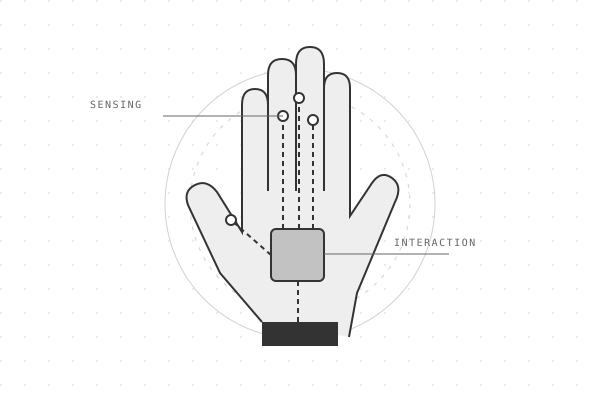
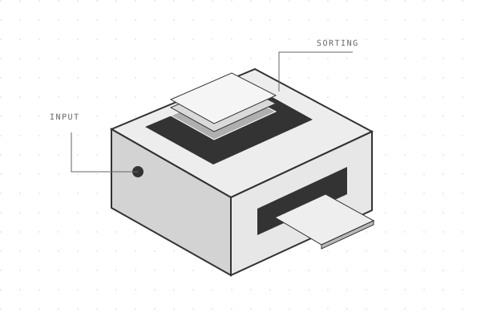
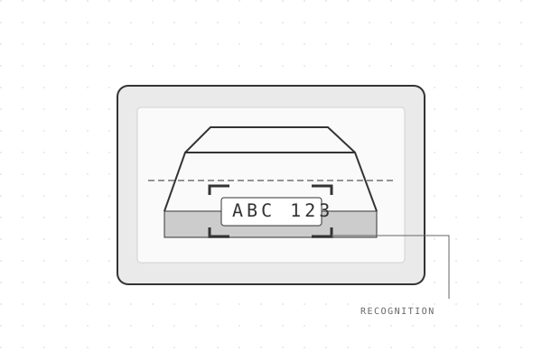

<!-- Generated by scripts/build.mjs from content/profile.json. Edit the source, then rebuild. -->
<picture>
  
  
</picture>

<a href="#a-quick-introduction">Introduction</a> · <a href="#selected-work">Selected work</a> · <a href="#open-source-notebook">Open source</a> · <a href="#engineering-focus">Engineering focus</a> · <a href="#lets-talk">Contact</a>

## A quick introduction

**Hi, I’m Lahiru Maduranga, an Embedded Systems Engineer from Sri Lanka.**

I develop embedded firmware and integrate microcontrollers, sensors, and connected devices. My work spans hardware–software integration, robotics, and computer vision, with a focus on the practical challenges of connecting code to physical systems.

**[LinkedIn](https://www.linkedin.com/in/lahiru-maduranga97/) · [GitHub](https://github.com/LahiruMaduranga) · [Upwork](https://www.upwork.com/freelancers/~0171e571e38bac7875) · [Fiverr](https://www.fiverr.com/users/lahiru255/portfolio)**

## Find the work relevant to you

| Your interest | Start here |
| --- | --- |
| Embedded engineering roles | [Sensor interfaces and firmware](#open-source-notebook) |
| Robotics and automation | [Card sorting and vision-guided manipulation](#selected-work) |
| Product development or freelance collaboration | [View my Upwork profile](https://www.upwork.com/freelancers/~0171e571e38bac7875) |

## Selected work

Project photographs and design renders are labelled individually. Concept illustrations are used for projects without supplied images.

### VR Haptic Glove

*Concept illustration.*

**Human–machine interaction · 2023–2024**

Exploring the connection between physical interaction and virtual environments.

Project overview

A haptic glove project listed in my engineering portfolio. It brings together my interests in embedded systems and interactive hardware.

[Discuss this project on LinkedIn](https://www.linkedin.com/in/lahiru-maduranga97/)

### MTG Card Sorting Machine

*Concept illustration.*

**Physical automation · 2023**

A card-sorting project at the intersection of hardware and automation.

Project overview

A machine project focused on sorting Magic: The Gathering cards. It is part of my work exploring practical automation.

[Discuss this project on LinkedIn](https://www.linkedin.com/in/lahiru-maduranga97/)

### Real Time Object Recognition and Robot Arm Controls

*Concept illustration.*

**Object recognition & control**

A project connecting real-time object recognition with robotic arm control.

Project overview

This project brings object recognition and robotic arm control together. View the original project entry in my Upwork portfolio, or contact me to discuss the work.

[View project on Upwork](https://www.upwork.com/freelancers/~0171e571e38bac7875?p=1626377752716083200)

### ALPR Unit with Gate Control

*Concept illustration.*

**Recognition & access control · 2023–2024**

An automatic license plate recognition unit with a gate-control function.

Project overview

An ALPR unit combining license plate recognition with gate control. The supplied project presentation shows the unit's enclosure and front-facing imaging area.

[Discuss this project on LinkedIn](https://www.linkedin.com/in/lahiru-maduranga97/)

### AC Power & Battery Charging Board

**Power & integration**

A power-board design for powering Arduino projects from AC, with a battery-charging function.

Project overview

A power-supply board presented with AC input and battery-charging functionality. The supplied design render shows an enclosed power module, connector terminals, a USB connector, and the surrounding power circuitry.

[View Fiverr portfolio](https://www.fiverr.com/users/lahiru255/portfolio)

### Embedded Development Board

**PCB & device integration**

A development-board design bringing a shielded module, pushbuttons, and pin headers together on one PCB.

Project overview

An embedded development-board design shown in the supplied PCB render. The layout includes a shielded module, two pushbuttons, edge pin headers, and supporting components.

[View Fiverr portfolio](https://www.fiverr.com/users/lahiru255/portfolio)

## Open-source notebook

### Multiple analog sensors on an ESP8266

An experiment in working with a hardware constraint: reading multiple analog sensors through the ESP8266’s single analog input using sequential sensor switching.

The repository includes an Arduino C++ sketch and circuit diagram.

**[Explore the repository](https://github.com/LahiruMaduranga/Read-Multiple-Analog-sensor-values-with-esp8266-Nodemcu)**

## Engineering focus

| Area | Focus |
| --- | --- |
| Firmware and embedded hardware | Microcontroller projects and sensor interfaces |
| Robotics and automation | Physical interaction, sorting, and manipulation |
| Computer vision | Image-based recognition and perception |

### Tools I work with

| Area | Tools |
| --- | --- |
| Firmware languages | C · C++ · Python |
| Microcontrollers | ESP32 · STM32 · Arduino · nRF · RP2040 |
| Device communication | UART · I²C · SPI · CAN · BLE · Wi-Fi |
| Linux & connected devices | Raspberry Pi · Embedded Linux · IoT connectivity |
| Integration & debugging | Sensor integration · Peripheral control · Firmware debugging |

[Embedded systems services on Fiverr](https://www.fiverr.com/lahiru255/develop-esp32-stm32-embedded-systems-and-iot-solutions)

## Let’s talk

Have an engineering role, a freelance project, or a collaboration in mind? Let’s discuss what you’re building.

**[Hire through Upwork](https://www.upwork.com/freelancers/~0171e571e38bac7875) · [View Fiverr portfolio](https://www.fiverr.com/users/lahiru255/portfolio) · [Connect on LinkedIn](https://www.linkedin.com/in/lahiru-maduranga97/)**
