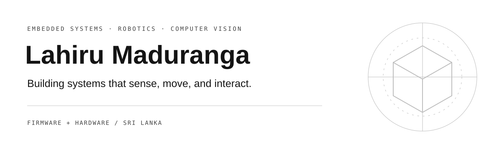
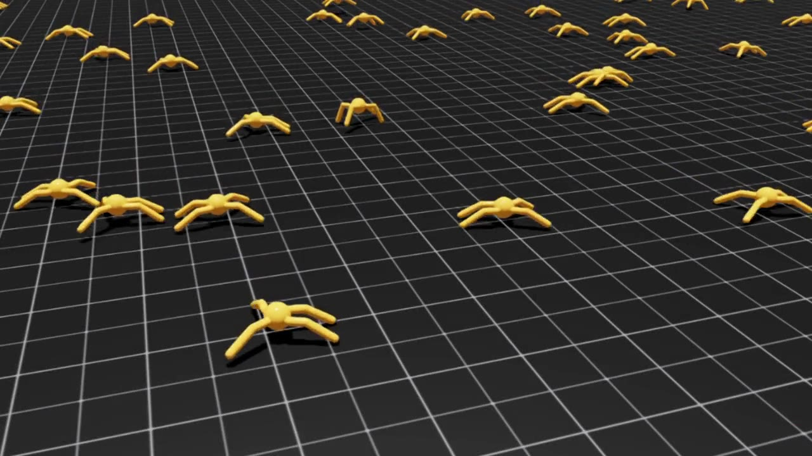

<!-- Generated by scripts/build.mjs from content/profile.json. Edit the source, then rebuild. -->
<a href="https://lahirumaduranga.github.io/"><picture>
  <source media="(prefers-color-scheme: dark)" srcset="assets/banner-dark.svg">
  
</picture></a>

<a href="#-the-60-second-tour">Tour</a> · <a href="#-hiring-for-start-here">Hiring for…?</a> · <a href="#%EF%B8%8F-featured-work">Featured work</a> · <a href="#-in-simulation">Simulation</a> · <a href="#-journey">Journey</a> · <a href="#-toolbox">Toolbox</a> · <a href="#-lets-talk">Contact</a>

> [!TIP]
> Recruiters and interviewers: start with **Hiring for…?** to jump to the projects that match your role. Each featured project links to a full case study on my portfolio.

## ⚡ The 60-second tour

- **Embedded Systems Engineer** with more than five years of hands-on experience, currently **Senior Embedded Systems Engineer at Surge Robotics**.
- Work spans low-level firmware and microcontroller interfaces through hardware integration, sensor systems, robotics, computer vision, and edge AI.
- Built hardware prototypes including an **ALPR unit with gate control**, an **MTG card recognition and sorting machine**, and an **autonomous rover** with LiDAR and stereo-camera sensing.
- Tested autonomy in simulation: autonomous driving in **CARLA** and four-legged robot training in **NVIDIA Isaac Sim**.

## ⚙️ How I engineer

<picture>
  <source media="(prefers-color-scheme: dark)" srcset="assets/assembly-dark.svg">
  
</picture>

## 🧭 Hiring for…? Start here

| You're hiring for | Look at |
| --- | --- |
| Embedded firmware & hardware | [Autonomous Rover](https://lahirumaduranga.github.io/projects/rover-chassis.html) · [MTG Sorter](https://lahirumaduranga.github.io/projects/card-sorter.html) · [More on the portfolio](https://lahirumaduranga.github.io/#projects) |
| Robotics & autonomy | [Autonomous Rover](https://lahirumaduranga.github.io/projects/rover-chassis.html) · [CARLA & Isaac Sim clips](#-in-simulation) |
| Computer vision | [ALPR Unit](https://lahirumaduranga.github.io/projects/alpr.html) · [MTG Sorter](https://lahirumaduranga.github.io/projects/card-sorter.html) · [Garment Measurement](https://lahirumaduranga.github.io/projects/garment-measurement.html) |
| Product development or collaboration | [Connect on LinkedIn](https://www.linkedin.com/in/lahiru-maduranga97/) |

## 🛠️ Featured work

- **[ALPR Unit with Gate Control](https://lahirumaduranga.github.io/projects/alpr.html)** — An automatic license plate recognition unit with a gate-control function. [Case study →](https://lahirumaduranga.github.io/projects/alpr.html)
- **[MTG Card Recognition & Sorting Machine](https://lahirumaduranga.github.io/projects/card-sorter.html)** — A machine-vision-based system designed to identify trading cards and support automated sorting through card recognition, OCR, variant classification, and backend integration. [Case study →](https://lahirumaduranga.github.io/projects/card-sorter.html)
- **[Autonomous Rover & Sensor Integration](https://lahirumaduranga.github.io/projects/rover-chassis.html)** — An integrated mobile robotics platform combining embedded control, onboard sensing, and perception components for autonomous-system development. [Case study →](https://lahirumaduranga.github.io/projects/rover-chassis.html)
- **[Garment Measurement System](https://lahirumaduranga.github.io/projects/garment-measurement.html)** — A computer-vision system for measuring garments as part of quality control. [Case study →](https://lahirumaduranga.github.io/projects/garment-measurement.html)

More projects, including hardware designs and confidential work, are on my **[portfolio](https://lahirumaduranga.github.io/#projects)**.

## 🎬 In simulation

<table><tr>
<td width="50%" valign="top"> <b>Urban Driving Simulation with CARLA</b> An autonomous vehicle in the CARLA simulator keeping its lane, holding distance behind traffic, and waiting at the intersection before moving on.</td>
<td width="50%" valign="top"> <b>Spider Robot Simulation with Isaac Sim</b> Four-legged spider robots being trained to walk, running in parallel in NVIDIA Isaac Sim.</td>
</tr></table>

Stills from the clips; watch them on the <a href="https://lahirumaduranga.github.io/#simulation">portfolio</a>.

## 📈 Journey

- **Senior Embedded Systems Engineer** · Surge Robotics · Sri Lanka  
  January 2025 – Present
- **Embedded Systems Engineer** · Surge Robotics · Sri Lanka  
  January 2024 – January 2025
- **Embedded Systems Engineer** · MechDev Lab · Sri Lanka  
  December 2022 – January 2024

## 🧰 Toolbox

| Area | Tools and topics |
| --- | --- |
| Embedded Systems & Firmware | C · C++ · ESP32 · STM32 · Python · Arduino · RP2040 · nRF · Firmware debugging · Peripheral control |
| Hardware Integration | Sensor integration · PCB design & prototyping · Microcontroller interfacing · Servo & motor actuation · Hardware/software integration |
| Robotics & Simulation | Mobile robot platforms · LiDAR & stereo-camera integration · AprilTag detection · NVIDIA Isaac Sim · CARLA driving simulation · Robot arm control · Legged-robot training |
| Computer Vision & Edge AI | OpenCV · YOLO11 pose estimation · BiRefNet segmentation · ChArUco camera calibration · License-plate recognition · Roboflow datasets |
| IoT & Connectivity | UART · I²C · SPI · CAN · BLE · Wi-Fi · IoT connectivity |
| Platforms & Tools | Embedded Linux · Raspberry Pi · Git & GitHub · Serial diagnostics |

## 📫 Let's talk

Interested in embedded systems, firmware, robotics, IoT, or intelligent edge applications? Let's discuss what you're building.

**[Connect on LinkedIn](https://www.linkedin.com/in/lahiru-maduranga97/) · [Visit my portfolio](https://lahirumaduranga.github.io/)**

<a href="#top">Back to top ↑</a>

